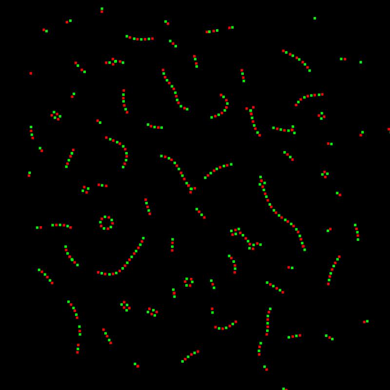

# Particle Simulation in JavaScript

This project is an interactive 2D particle system demonstrating emergent behavior of charged particles under simplified electrostatic-like forces. The simulation:

* Visualizes how particles attract or repel based on configurable charges.
* Supports toggling between Coulomb-like 1/r² decay and linear 1/r decay.
* Implements toroidal boundary conditions (particles wrap around the edges).
* Provides a variety of tunable parameters, including force strength, inertia damping, and minimum interaction distance.

Features:

* Toroidal space: no hard edges - particles seamlessly wrap.
* Dynamic controls: adjust forces and damping live.
* Custom initialization: offset the field or randomize starting positions.
* This simulation is intended as an educational demo and a playground for experimenting with emergent patterns.

---

[Demo](https://xcont.com/coulomb/)

---

## License

MIT License. See [LICENSE](LICENSE) for details.

---

## Author

Serhii Herasymov  

sergeygerasimofff@gmail.com  

https://github.com/xcontcom
